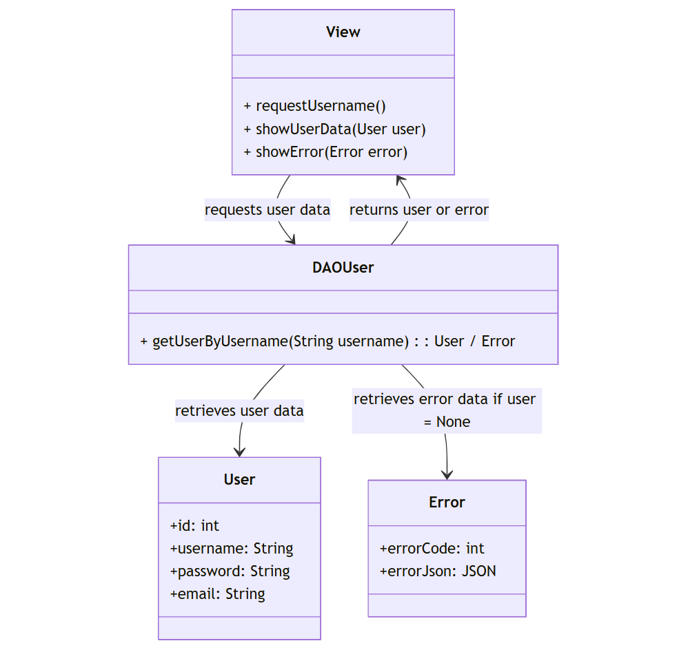

## Prototip 1

## HTTP Request & Response

- [Request](../Informació/http.request.md)

- [Response](../Informació/http.response.md)

## Definició dels EndPoints del WebService
Definició dels EndPoints del Servei Web:

Què necessitem per cada End-point

- <b>Descripció</b>: Servei que consulta si existeix un User per Username.
- <b>HOST</b>: 192.168.144.63:10050
- <b>End-point (URL)</b>: http://192.168.144.63:10050/Prototip1/getuser/username
- <b>Method</b>: GET
- <b>Tipus de petició</b>: application/json
- <b>Parametres que necessita la petició</b>: Username (String).
- <b>Resposta</b>: 

Si l'usuari existeix, el servei retorna: 
         

    Code 200 Ok: {
        "satus": "success",
        "message": "User found",
        "data": {
            "Username": "usuari1",
            "ID": "1"
            "Email": "user@gmail.com"
        } 
    }

Si l'usuari no existeix, retorna:    

    Code 404: {
        "satus": "error",
        "message": "User not found"
    }

Si falta el paràmetre, retorna:

    Code 400: {
        "status": "error",
        "message": "User parameter is missing"
    }

## Diagrames 

------

## <b>Dades d'entrada de l'usuari</b>

<b>Inici</b>
- <b>Contactar amb suport:</b> L'usuari pot enviar un missatge a l'equip d'assistència tècnica detallant-ne la consulta o el problema. Es presenta un formulari on heu d'ingressar el vostre correu electrònic i escriure el vostre missatge.
- <b>Registre:</b> L'usuari s'ha de registrar amb un correu electrònic vàlid i una contrasenya que contingui almenys lletres i números.
- <b>Inici de sessió:</b> L'accés al compte es fa mitjançant correu electrònic i contrasenya.
- <b>Recuperació de contrasenya:</b> Si l'usuari oblida la clau, podeu sol·licitar la vostra recuperació introduint el vostre correu electrònic registrat. S'enviarà un enllaç per restablir la contrasenya.

<b>Pantalla principal</b>
- <b>Infants a càrrec:</b> Es mostra una llista de nens sota la cura de l'usuari.
- <b>Informació del pegat:</b> Es proporciona informació sobre l'ús del pegat als nens a càrrec, incloent hores de col·locació i retir.
- <b>Configuració:</b> Es permet a l'usuari realitzar ajustaments al vostre perfil ia l'aplicació.
  - <b>Editar perfil:</b> Opció per modificar dades personals, afegir nova informació o actualitzar seccions existents.
  - <b>Configuracions generals:</b> Personalització de la interfície, incloent opcions com a mode fosc i mida de text.
  - <b>Tancar sessió:</b> L'usuari haurà de confirmar abans de tancar sessió a l'aplicació.

