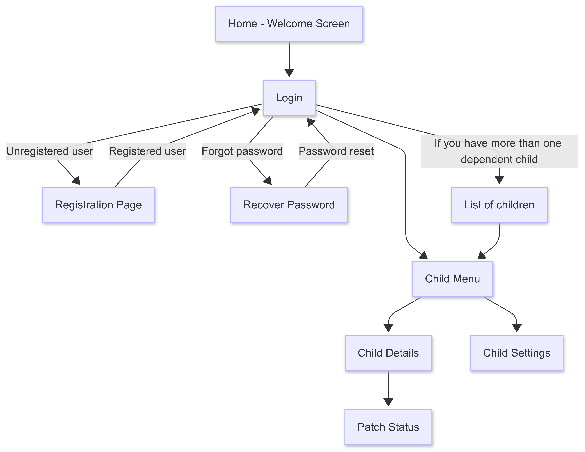

## WireFrames

 

### Inici
- <b>Benvinguda:</b> Es mostra la pantalla de benvinguda amb opcions per iniciar sessió o registrar-se.
- <b>Registre:</b> L'usuari s'ha de registrar amb un correu electrònic vàlid i una contrasenya que contingui almenys lletres i números.
- <b>Inici de sessió:</b> L'accés al compte es fa mitjançant correu electrònic i contrasenya.
- <b>Recuperació de contrasenya:</b> Si l'usuari oblida la clau, podeu sol·licitar la vostra recuperació introduint el vostre correu electrònic registrat. S'enviarà un enllaç per restablir la contrasenya.

### Pantalla principal
- <b>Infants a càrrec:</b> Si l'usuari té més d’un infant a càrrec, es mostrarà una llista amb els seus noms.
- <b>Menú de l'infant:</b> En seleccionar un infant de la llista, es pot accedir a les seves dades i configuracions.
  - <b>Detllas de l'infant:</b>  Es mostren les dades principals de l’infant seleccionat, incloent-hi el seu nom, edat i altres dades rellevants. 
  - <b>Estat del pegat:</b> Es proporciona informació sobre l’ús del pegat, com ara el temps de col·locació, retir i estat actual.
  - <b>Configuració de l'infant:</b> Opció per modificar les preferències i la informació relacionada amb l’infant.
  kk