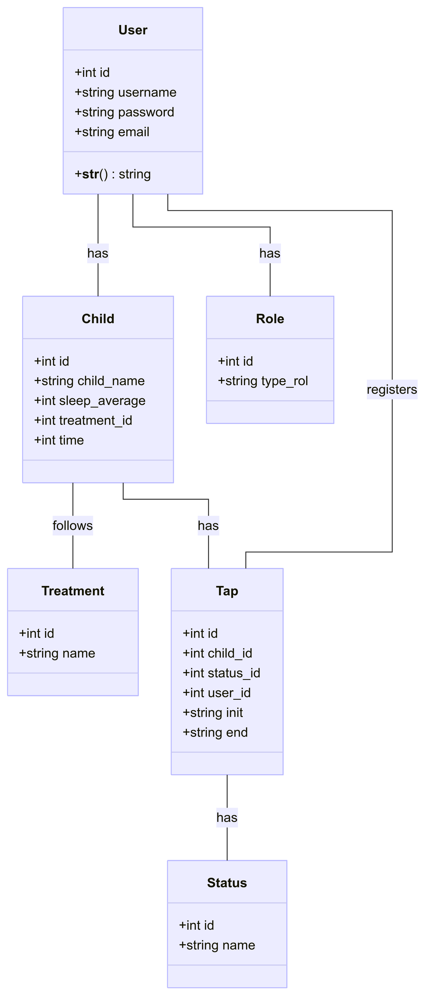

## WireFrames

 

## Descripció
### Pantalla d’Inici i Autenticació
- <b>Benvinguda:</b> Es mostra una pantalla amb opcions per iniciar sessió o registrar-se.
- <b>Registre d’Usuari</b>:
  	- Correu electrònic (validació requerida)
  	- Contrasenya (ha de contenir lletres i números)
- <b>Inici de Sessió</b>:
	- Accés amb correu electrònic i contrasenya.
- <b>Recuperació de Contrasenya</b>: Si l’usuari oblida la seva clau:
    1. Introdueix el correu electrònic registrat.
  	2. Rep un enllaç per restablir la contrasenya.

### Pantalla Principal
- <b>Infants a Càrrec</b>: Si l'usuari té més d’un infant a càrrec, es mostrarà una llista amb els seus noms. En seleccionar un infant, es redirigeix al < Menú de l’Infant >.

### Menú de l'Infant
- <b>Detalls de l'Infant</b>: Esmostres les dades principals:
    - Nom
    - Edat
    - Informació rellevant (Estat del pegat)
- <b>Estat del pegat</b>: Es mostra informació com:
    - Temps de col·locació
    - Temps de retirada
    - Estat actual
- <b>Configuració de l'Infant</b>: Opcions per modificar les preferències i informació associada.

## Diagrama d'arquitectura 

## Diagrama de classes de Backend i Front-End

[BackEnd](dadesPro2.mmd)

## Implementació