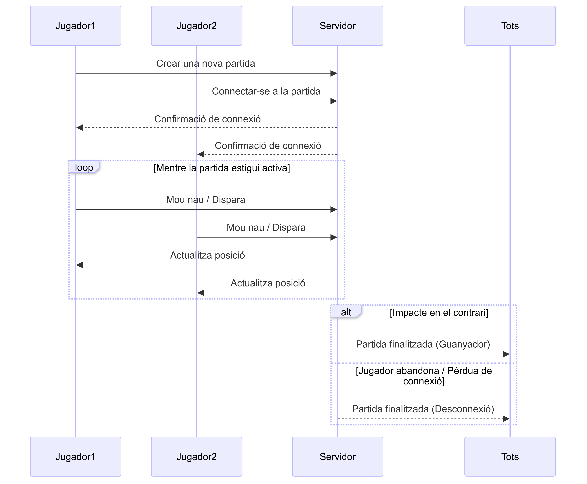

## Diagrama de Seqüència - Joc mòbil

Un joc de telèfon mòbil on participen 2 jugadors cadascun amb la seva pròpia terminal.

- Quan els 2 jugadors desitgen jugar, un d'ells crea una nova partida i l'altre es connecta.
- L'objectiu del joc és pilotar una nau i disparar al contrari.
- Si un dels 2 jugadors encerta, la partida acaba.
- Si un dels 2 jugadors deixa la partida (o es perd la connexió) la partida acaba.
